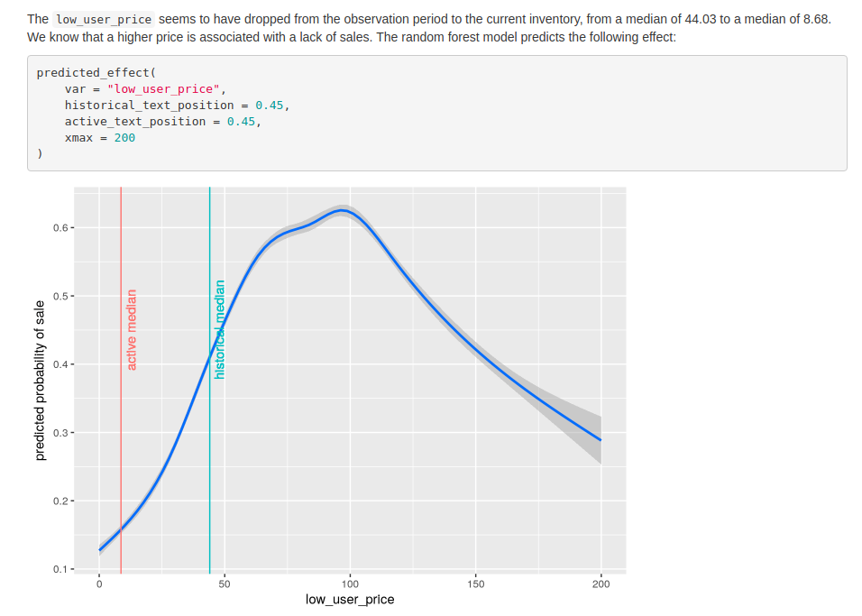
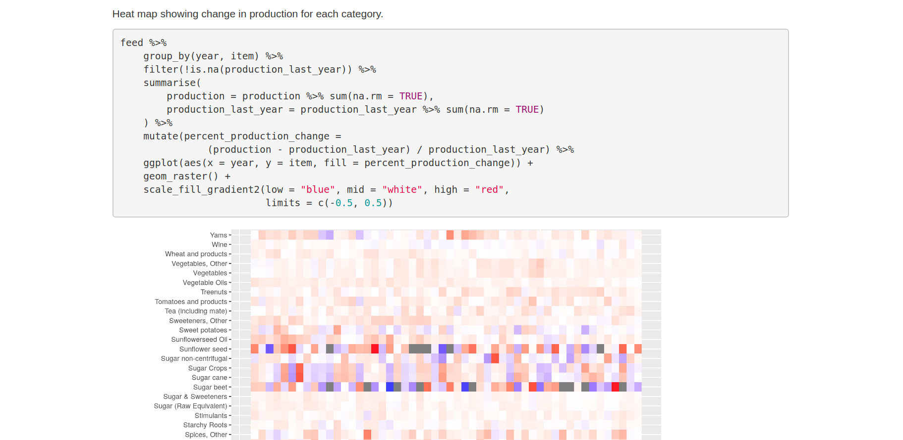

+++
title = "R Markdown"
date = "2014-04-09"
+++

&nbsp;| Description | Preview | Repository
------|-------------|---------|-----------
[flenderson_sales](/rmd/flenderson_sales.html) | Exploratory data analysis and some modelling effort of sales data from Kaggle |  | [GitHub](https://github.com/mdneuzerling/flenderson_sales)
[user2018_full](/rmd/user2018_full.html) | Presentation about R and a review of the [useR2018 conference](https://user2018.r-project.org/) that I gave to some Python-using data scientists in August 2018 |  | [GitHub](https://github.com/mdneuzerling/useR2018_recap)
[feed](/rmd/feed.html) | Brief exploratory data analysis of feed production data, with a focus on hierarchical time series |  | [GitHub](https://github.com/mdneuzerling/feed)
[ModelAsAPackage](/rmd/ModelAsAPackage.html) | Model training vignette used in my demonstration of an executable model as an R package |  | [GitHub](https://github.com/mdneuzerling/ModelAsAPackage)
