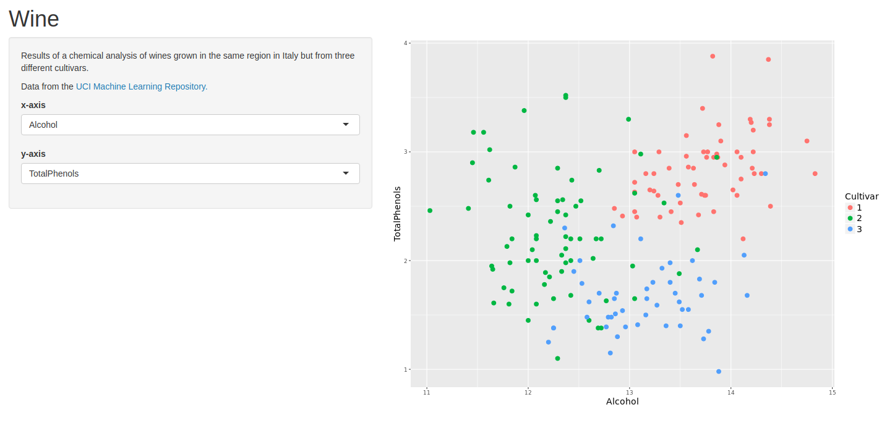
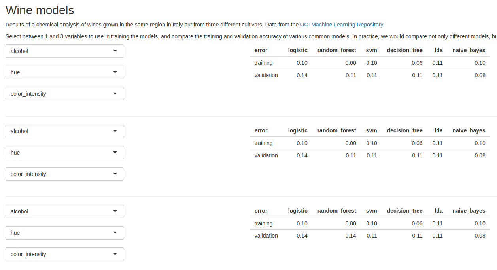
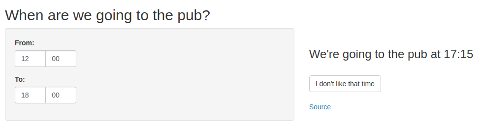

+++
title = "Shiny"
date = "2014-04-09"
+++

[Shiny](https://shiny.rstudio.com/) is an R package for building web applications in R. These are a few simple Shiny applications that I have built:

&nbsp;| Description | Preview | Repository
------|-------------|---------|-----------
[wine](https://shiny.mdneuzerling.com/wine) | Choose two variables to create a scatterplot that best separates three cultivars of wine |  | [GitHub](https://github.com/mdneuzerling/shiny_wine)
[wine_models](https://shiny.mdneuzerling.com/wine_models) | Comparison of a few different models to determine the cultivars of wines based on their chemical properties |  | [GitHub](https://github.com/mdneuzerling/shiny_wine_models)
[pub_time](https://shiny.mdneuzerling.com/pub_time) | My friends couldn't decide when to go to the pub. This app picks a random time between two end points, and declares it pub time. |  | [GitHub](https://github.com/mdneuzerling/shiny_pub_time)

